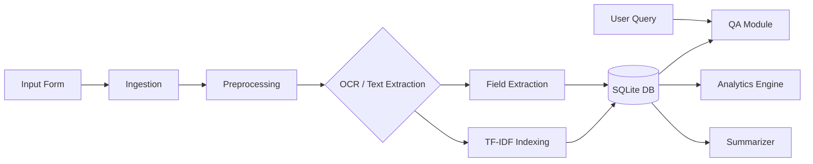

# System Architecture

The Intelligent Form Agent follows a modular pipeline architecture.

## Modules

1.  **Ingestion**: `src/ingestion.py`
    *   Detects file type (PDF vs Image).
    *   Converts PDF pages to images for OCR fallback.
    *   Extracts raw text from digital PDFs using `pdfplumber`.

2.  **Preprocessing**: `src/preprocessing.py`
    *   Applies OpenCV filters: Grayscale -> Gaussian Blur -> Adaptive Thresholding.
    *   Ensures clean input for Tesseract.

3.  **OCR**: `src/ocr.py`
    *   Wraps `pytesseract`.
    *   Outputs full text and dataframes with layout info.

4.  **Extractor**: `src/extractor.py`
    *   Engine containing Regex patterns and Keyword logic.
    *   Extracts specific fields (Name, Phone, etc.).

5.  **Storage**: `src/storage.py`
    *   SQLAlchemy models for Forms.
    *   Handles saving and retrieving metadata.

6.  **QA & Summarizer**: `src/qa.py`, `src/summarizer.py`
    *   Uses `TfidfVectorizer` and `cosine_similarity` from `sklearn`.
